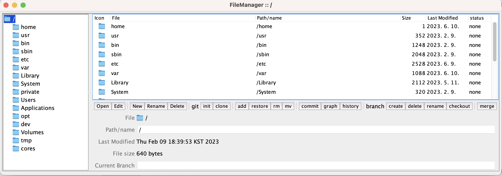

file-manager
============

[](http://search.maven.org/#search%7Cga%7C1%7Cg%3A%22com.github.javadev%22%20AND%20a%3A%22filemanager%22)
[](https://github.com/javadev/file-manager/actions/workflows/maven.yml)
[](https://github.com/javadev/file-manager/actions/workflows/codeql-analysis.yml)

A simple Java/Swing native file manager capable of performing Git repository management.

***

## Project Introduction
 file-manager is a GUI developed to perform simple Git repository management based on javadev/file-manager. In addition to file-explorer functions such as open, edit, and rename, which are included in the existing file-manager, buttons to execute Git commands have been added to make Git repository management more convenient.

***

## Development period and Member composition
> 2023.04.27. ~ 2023.05.13.

> 곽태환 @TaeHwan-Gwak : CAU-CSE

> 정승원 @frankwon11 : CAU-CSE

> 엄찬우 @eomchanu : CAU-CSE

***

## Development Environment
+ Java 
+ openJDK version 20.0.1
+ IDE : IntelliJ IDEA
+ MAC OS

***

## Main function
### File-Management
 1. The file browsing starts from the root directory of the computer.
 2. file open, edit, new(create), rename, delete function.

### Version-Controlling
 1. By checking the status, can check whether GitDir is None, that is, it is not set.
 2. Git commands such as git add, git restore, git rm, git mv can be executed. (For git restore and git rm, you can select in detail after pressing the button)
 3. git commit : When click the button, can commit after checking what the currently staged files are.
 4. git init : When repository creation is declared in the current directory, a new git repository is created.

### Git repository management service
 1. Branch management : branch create, delete, rename, checkout
 2. Branch merge(not rebase) : abort in case of conflict
 3. Simple git commit history : shows the log as a graph, and also shows a brief commit description.
 4. Git clone from Github

***

## How to Run
 1. Clone the master branch from https://github.com/TaeHwan-Gwak/OSS_PROJECT
 2. Run the 'fileManager.java'
 
 
+ How to manually install the jgit library when an error occurs

Add the following code to pom.xml and install

```html
 <dependency>
      <groupId>org.eclipse.jgit</groupId>
      <artifactId>org.eclipse.jgit</artifactId>
      <version>5.9.0.202009080501-r</version>
 </dependency>
 ```

***

## Example
### original file-manager
[](https://github.com/javadev/file-manager/)
### file-manager capable of performing Git command

