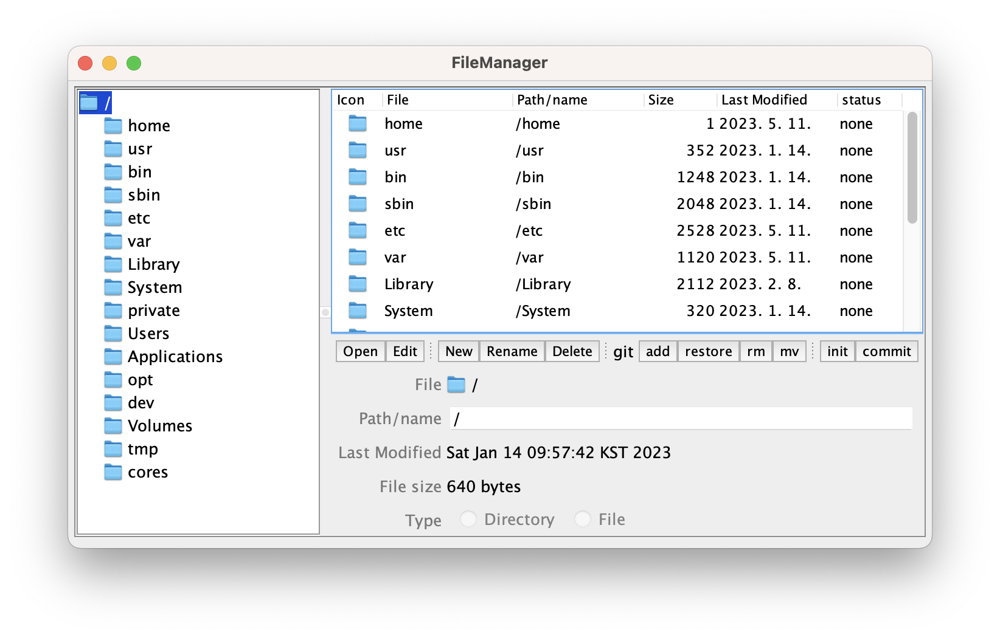

file-manager
============

A simple Java/Swing native file manager capable of performing Git repository management.

***

## 프로젝트 소개
 file-manager는 javadev/file-manager를 기반으로 simple Git repository management를 수행할 수 있도록 개발된 Gui이다. 기존 file-manager에 포함된 open, edit, rename 등의 file-explorer의 기능 뿐 아니라 Git repository를 creation하고 git add, git commit 과 같은 git 명령어를 수행할 수 있는 버튼을 추가하여 좀 더 간편하게 Git repository management를 할 수 있도록 했다.

***

## 개발 기간 및 멤버 구성
> 2023.04.27. ~ 2023.05.12.

> 곽태환 @TaeHwan-Gwak :

> 정승원 @frankwon11 :

> 엄찬우 @eomchanu : 

***

## 개발 환경
+ Java 
+ openJDK version 20.0.1
+ IDE : IntelliJ IDEA
+ MAC OS

***

## 주요 기능
### file-explorer
 1. The file browsing starts from the root directory of the computer.
 2. open, edit, new(create), rename, delete 의 기능 수행 가능.

### Version controlling
 1. status 확인을 통해 GitDir 인지 None, 즉 설정되어 있지 않은지 확인 가능.
 2. git add, git restore, git rm, git mv의 깃 명령어 수행 가능. (git restore, git rm 의 경우 버튼을 누른 후 세부적으로 선택 가능)
 3. git commit : 버튼을 눌렀을 때 현재 staged 파일이 어떤 것들이 있는지 확인 후 commit 가능.
 4. git init : 현재 Directory 에 repository creation 이 선언되었을 때, a new git repository를 생성.

***

## Example
### 기존 file-manager

### file-manager capable of performing Git repository management

